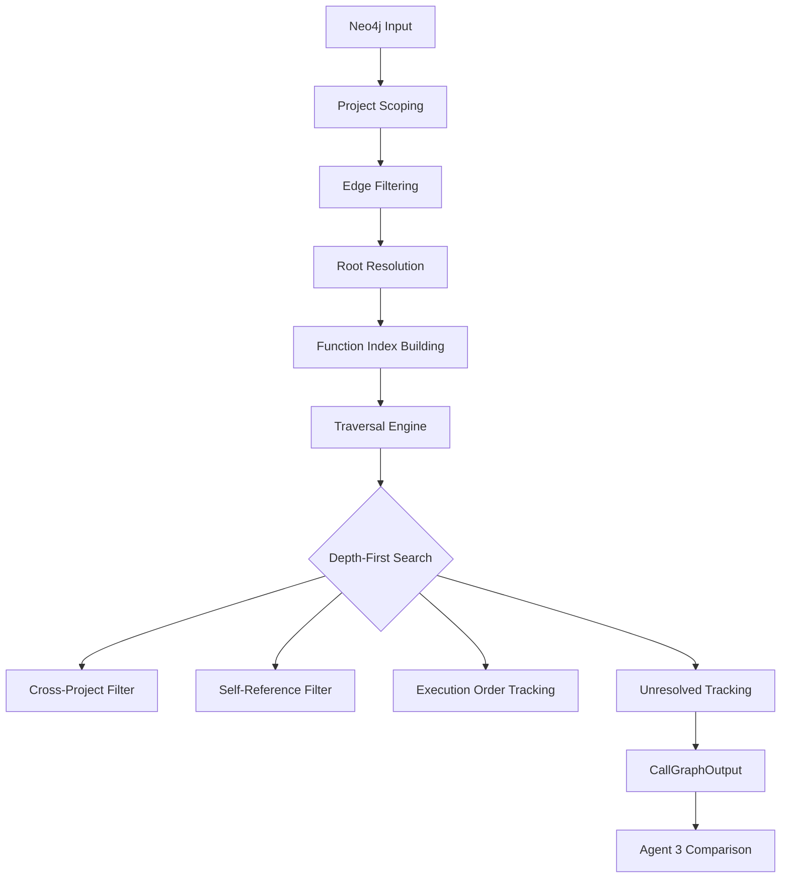

# Agent 2 Mind Map: Deep Technical Analysis

## Overview
**Agent 2 (Index Builder)** is the core reconstruction engine that independently builds call graphs from indexed source code, serving as the critical counterpoint to Agent 1's Neo4j data.

## Core Architecture

### 1. Input Processing Pipeline
```
Neo4j Root Data → Project Scoping → Function Resolution → Traversal Engine
```

**Input Sources:**
- Neo4j execution flow data (flow_id, root_function, root_file, root_class)
- Optional: Neo4j hint files (for scope constraint)
- Pre-built code index from SQLite/CodeIndex database

**Processing Chain:**
1. **Project Prefix Derivation** (`_derive_project_prefix`)
   - Analyzes root_file path from Neo4j
   - Matches against indexed file paths
   - Extracts top-level project directory (e.g., "011-MultiLevelList")
   - Prevents cross-project contamination

2. **Edge Filtering & Mapping** (`build` method)
   - Filters edges to project scope only
   - Creates dual-index lookup system:
     - `func_to_file[KEY]` - bare function names
     - `func_to_file[CLASS.KEY]` - qualified names for Neo4j compatibility
   - Tracks cross-project skips for diagnostics

3. **Root Resolution Strategy** (multi-tier fallback)
   ```
   Original Name → Bare Name → Class Fallback → Class Members Traversal
   ```
   - Handles Neo4j qualified names (e.g., "TForm1.Button2Click")
   - Strips class prefix to find bare function
   - Falls back to class-level traversal for .dfm forms

### 2. Traversal Engine (`_traverse` method)
```
Depth-First Search with Cross-Project Guardrails
```

**Key Features:**
- **Project Scoping**: Enforces boundaries during traversal
- **Self-Reference Filtering**: Skips `func → func` edges
- **Execution Order Tracking**: Preserves call sequence from Neo4j
- **Unresolved Tracking**: Records missing callees for Agent 3 analysis
- **Depth Limiting**: Prevents infinite recursion (max_depth=50)

## 2. Data Sources & Dependencies

### Primary Data Sources
1. **CodeIndex Database** (`trustbot.index.code_index`)
   - SQLite backend storing pre-chunked function data
   - Provides: `get_edges()`, function lookups, file mappings

2. **Call Graph Builder** (`trustbot.indexing.call_graph_builder`)
   - Three-strategy edge detection:
     - **Strategy 1**: Direct regex function calls (`func(...)`)
     - **Strategy 2**: Bare function name scanning (Delphi/Pascal)
     - **Strategy 3**: .dfm form-to-handler event binding

### External Dependencies
- **No LLM/AI dependencies** - Purely rule-based
- **No network calls** - All data local
- **SQLite3** for persistence

## 3. Processing Workflow



### Phase 1: Initialization & Scoping
1. **Extract project boundaries** from Neo4j root_file
2. **Filter edges** to project scope
3. **Build dual-index lookup tables** for efficient resolution

### Phase 2: Root Resolution
1. **Primary attempt**: Use exact Neo4j root_function name
2. **Bare name fallback**: Strip "Class." prefix if needed
3. **Class fallback**: Use root_class for .dfm forms
4. **Class members traversal**: For form objects, traverse all member functions

### Phase 3: Graph Traversal
1. **Depth-first expansion** from resolved root
2. **Edge following**: Via pre-built edge_map
3. **Confidence scoring**: Based on extraction method
4. **Unresolved collection**: Missing functions marked for Agent 3

### Phase 4: Output Generation
1. **CallGraphOutput** object with full metadata
2. **Diagnostic metadata**: Scope constraints, skip counts, resolution paths
3. **Sample data**: For debugging and UI display

## 4. Key Capabilities

### Strengths
✅ **Deterministic**: Same input always produces same output
✅ **Fast**: SQLite queries + in-memory traversal
✅ **Project-aware**: Handles multi-project codebases cleanly
✅ **Cross-reference resolution**: Dual-index system handles naming variations
✅ **Confidence scoring**: Tracks extraction method provenance
✅ **Comprehensive diagnostics**: Rich metadata for debugging

### Limitations
❌ **Pattern-dependent**: Only recognizes functions matching regex patterns
❌ **No semantic understanding**: Cannot infer implicit relationships
❌ **Language-specific**: Each language needs manual pattern updates
❌ **Brittle fallback**: Whole-file chunk if patterns fail
❌ **No learning**: Cannot adapt to new coding patterns

## 5. Data Flow Model

### Input Data Schema
```typescript
interface Agent2Input {
  execution_flow_id: string
  root_function: string
  root_file?: string
  root_class?: string
  neo4j_hint_files?: Set<string>
}
```

### Output Data Schema
```typescript
interface CallGraphOutput {
  execution_flow_id: string
  source: 'FILESYSTEM'
  root_function: string
  edges: List<CallGraphEdge>
  unresolved_callees: List<string>
  metadata: {
    total_depth: number
    total_nodes: number
    index_functions: number
    index_edges: number
    project_prefix: string
    skipped_cross_project_edges: number
    neo4j_hint_files: string[]
    original_root: string
    resolved_root: string
    resolved_via: string
    root_class_hint: string
    root_file_hint: string
    root_found_in_index: boolean
    root_has_outgoing_edges: boolean
    root_outgoing_count: number
    sample_index_functions: string[]
    sample_edge_callers: string[]
  }
}
```

## 6. Integration Points

### With Agent 1 (Neo4j)
- **Receives**: Neo4j call graph via `validate_flow()` in pipeline
- **Provides**: Independent reconstruction for comparison
- **Comparison Point**: Agent 3 validates Agent 1 vs Agent 2 graphs

### With Agent 3 (Comparison)
- **Consumes**: Agent 2's `CallGraphOutput` 
- **Validation Logic**: Classifies edges as confirmed/phantom/missing
- **Trust Score Calculation**: Based on edge matching confidence

### With Code Indexer
- **Source**: Uses `chunk_codebase()` → `chunker.py` → `call_graph_builder.py`
- **Enrichment**: Adds execution order, confidence scores to raw chunks

## 7. Technical Debt & Improvement Opportunities

### Current Technical Debt
1. **Hardcoded Patterns**: Regex patterns require manual updates for new languages
2. **Dual Index Complexity**: Two lookup systems increase memory usage
3. **Limited Error Handling**: Few try/catch blocks, potential silent failures
4. **No Progress Indication**: No feedback during long traversals

### Suggested Improvements

#### High Priority
1. **LLM-Enhanced Function Detection**
   ```python
   # Replace regex with semantic parsing
   from trustbot.llm.function_detector import detect_functions
   
   async def enhanced_chunking(file_path: Path):
       content = await file_path.read_text()
       functions = await detect_functions(content, language)
       return [CodeChunk(...) for func in functions]
   ```

2. **Dynamic Pattern Learning**
   ```python
   class AdaptivePatternLearner:
       def __init__(self):
           self.pattern_cache = {}
       
       def learn_from_code(self, code: str, language: str):
           # Analyze function signatures in this codebase
           # Update regex patterns dynamically
           pass
   ```

3. **Unified Index System**
   ```python
   # Replace dual lookup with single intelligent resolver
   class UnifiedFunctionResolver:
       def resolve(self, name: str, context: dict) -> FunctionInfo:
           # Single resolution logic that handles all naming schemes
           pass
   ```

#### Medium Priority
1. **Enhanced Error Recovery**
   - Add retry logic for database connections
   - Graceful degradation when index is corrupted
   - Better logging with structured error codes

2. **Progress Streaming**
   - Emit progress events during traversal
   - Allow UI to show real-time traversal progress

#### Low Priority
1. **Performance Optimization**
   - Cache frequently accessed function lookups
   - Lazy loading of edge data
   - Query optimization for large codebases

## 8. Security & Safety Considerations

### Current Safeguards
✅ **Path validation**: Prevents directory traversal attacks
✅ **Project scoping**: Isolates projects from each other
✅ **SQL injection protection**: Uses parameterized queries
✅ **Memory limits**: Depth limiting prevents stack overflow

### Potential Risks
⚠️ **Code injection**: If regex patterns are exploited
⚠️ **Path disclosure**: Error messages might reveal file structure
⚠️ **DoS via complex graphs**: Deep recursion could cause performance issues

## 9. Testing Strategy

### Unit Test Coverage
```python
# Test project prefix derivation
def test_derive_project_prefix():
    assert _derive_project_prefix(
        "/mnt/storage/Delphi-Test/011-MultiLevelList/src/Unit1.pas",
        ["/mnt/storage/Delphi-Test/011-MultiLevelList/src/Unit1.pas"]
    ) == "011-MultiLevelList"

# Test dual-index resolution
def test_dual_index_resolution():
    # Test both bare and qualified name resolution
    pass
```

### Integration Tests
```python
async def test_agent2_pipeline():
    # Test full flow: Neo4j → Agent 2 → Agent 3
    neo4j_graph = create_mock_neo4j_graph()
    agent2 = Agent2IndexBuilder(mock_index)
    
    result = await agent2.build(
        execution_flow_id="test-flow",
        root_function="TestFunction",
        root_file="src/Test.pas"
    )
    
    assert result.root_function == "TestFunction"
    assert len(result.edges) > 0
    assert result.metadata["project_prefix"] == "test"
```

## 10. Recommendations

### Immediate Actions
1. **Implement LLM-enhanced function detection** to reduce pattern dependency
2. **Add progress streaming** for better UX during large traversals
3. **Enhance error handling** with structured error responses
4. **Create comprehensive test suite** covering all resolution paths

### Long-term Vision
1. **Semantic chunking** using AST parsing instead of regex
2. **Machine learning** for pattern recognition and optimization
3. **Cross-language support** through language-agnostic parsing strategies

This mindmap reveals Agent 2 as a sophisticated but rule-bound system that could benefit significantly from AI/LLM enhancements while maintaining its core strength of deterministic graph reconstruction.
